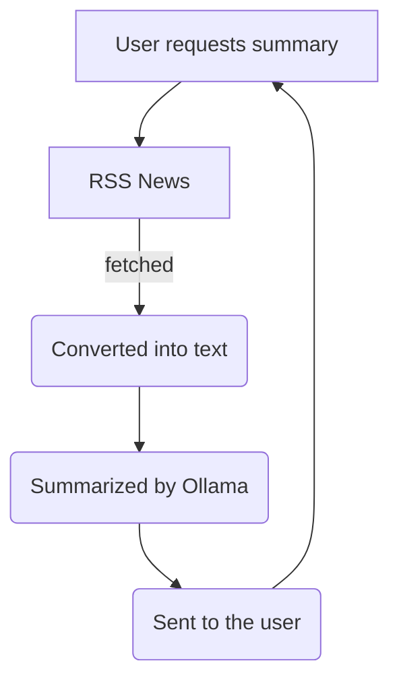

  
  <h1>OllaNews</h1>
  
<i>"News without the BS"</i>

  
  
  

---

## Overview
Ollanews is a news reader that allows you to search for topics of news, fetch articles by strippping away all the ads and also provide an ai summary for the artilces

### ️ How it Works

---
### Modules Developed
#### Frontend
- Landing Page: Simple search bar interface built with Django templates and CSS. It captures user-defined news topics and sends them to the backend via a GET request.
- Article List View: A feed displaying the title, source, and publication date of the top 10 articles retrieved from the RSS engine. Each entry includes a button to trigger the summarization process.
- Summary Display: An asynchronous UI component that uses JavaScript (Fetch API) to request and display the 3B model's output without reloading the entire page.
Backend
- RSS Aggregator: A Python module using feedparser to connect to Google News and other RSS XML endpoints. It filters results based on the user's search query.
- HTML Sanitizer: A cleaning script using BeautifulSoup to strip all <script>, <style>, and 
 tags, leaving only raw 
 tag content to reduce the token count for the LLM.
- Ollama API Client: A local HTTP request handler that sends the sanitized text to the Ollama server (running Llama 3B) using a specific system prompt to enforce a concise summary format.
- Django Controller: The central views.py logic that coordinates the flow: receiving the search query, calling the aggregator, passing text to the AI client, and returning a JSON response to the frontend.
