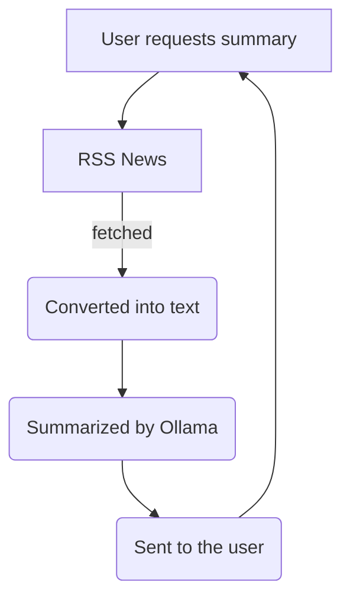

<div align="center">
  
  <h1>OllaNews</h1>
  <p><i>"News without the BS"</i></p>

  
  
  
</div>

---

## Overview
Ollanews is a news reader that allows you to search for topics of news, fetch articles by strippping away all the ads and also provide an ai summary for the artilces

---
##  Features
- RSS Aggregation: Fetches real-time news via Google News & more.
- Ad-Free Reading: Uses BeautifulSoup to strip scripts and ads, leaving only the content.
- AI Summarization: Powered by Ollama (Llama 3B) for local, private summaries.
- Async UI: Fast, AJAX-based summaries without page refreshes.

---
### Modules Developed
#### Frontend
- Landing Page: Simple search bar interface built with Django templates and CSS. It captures user-defined news topics and sends them to the backend via a GET request.
- Article List View: A feed displaying the title, source, and publication date of the top 10 articles retrieved from the RSS engine. Each entry includes a button to trigger the summarization process.
- Summary Display: An asynchronous UI component that uses JavaScript (Fetch API) to request and display the 3B model's output without reloading the entire page.
#### Backend
- RSS Aggregator: A Python module using feedparser to connect to Google News and other RSS XML endpoints. It filters results based on the user's search query.
- HTML Sanitizer: A cleaning script using BeautifulSoup to strip all <script>, <style>, and <div> tags, leaving only raw <p> tag content to reduce the token count for the LLM.
- Ollama API Client: A local HTTP request handler that sends the sanitized text to the Ollama server (running Llama 3B) using a specific system prompt to enforce a concise summary format.
- Django Controller: The central views.py logic that coordinates the flow: receiving the search query, calling the aggregator, passing text to the AI client, and returning a JSON response to the frontend.
---

Development Roadmap
- [ ] Core Engine & Performance
  - [ ] Implement support for asynchronous RSS fetching to reduce wait times.
  - [ ] Add caching layer (Redis or Django Cache) for frequently requested news topics.
  - [ ] Expand HTML Sanitizer to handle more complex article structures beyond <p> tags.
  - [ ] Optimize system prompts to reduce LLM output latency.
- [ ] Feature Expansion
  - [ ] Add support for custom RSS feed URLs beyond the default search engine.
  - [ ] Implement "Read Later" functionality using the Django database.
  - [ ] Create a dark mode toggle for the frontend CSS.
  - [ ] Add an export feature to save summaries as Markdown or PDF files.
- [ ] AI & LLM Integration
  - [ ] Add support for multiple Ollama models (e.g., Mistral, Phi-3) via a settings menu.
  - [ ] Implement "Contextual Follow-up" to ask the AI questions about a specific article.
  - [ ] Develop a sentiment analysis tag for each fetched article.
- [ ] Infrastructure & Deployment
  - [ ] Create a Docker Compose file to orchestrate the Django app and Ollama container.
  - [ ] Set up environment variable management for API endpoints and model names.
  - [ ] Write unit tests for the RSS aggregator and sanitization logic.

### How it Works


---

### Project structure
``` bash
OllaNews/
├── core/                  # Project configuration and routing
├── news/                  # Main application module
│   ├── services/          # Core logic (Aggregator, Sanitizer, Ollama Client)
│   ├── static/            # CSS and AJAX-based JavaScript
│   ├── templates/         # Django HTML templates
│   ├── models.py          # Database schema for articles
│   ├── urls.py            # App-specific API and View routes
│   └── views.py           # Controller logic
├── manage.py              # Django CLI
└── requirements.txt       # Dependencies (django, feedparser, beautifulsoup4, requests)
```
---
### Installation
1. Clone the repo: `git clone ...`
2. Install dependencies: `pip install -r requirements.txt`
3. Setup Ollama: Ensure Ollama is running and pull the model: `ollama pull llama3:3b`
4. Run Server: `python manage.py runserver`


