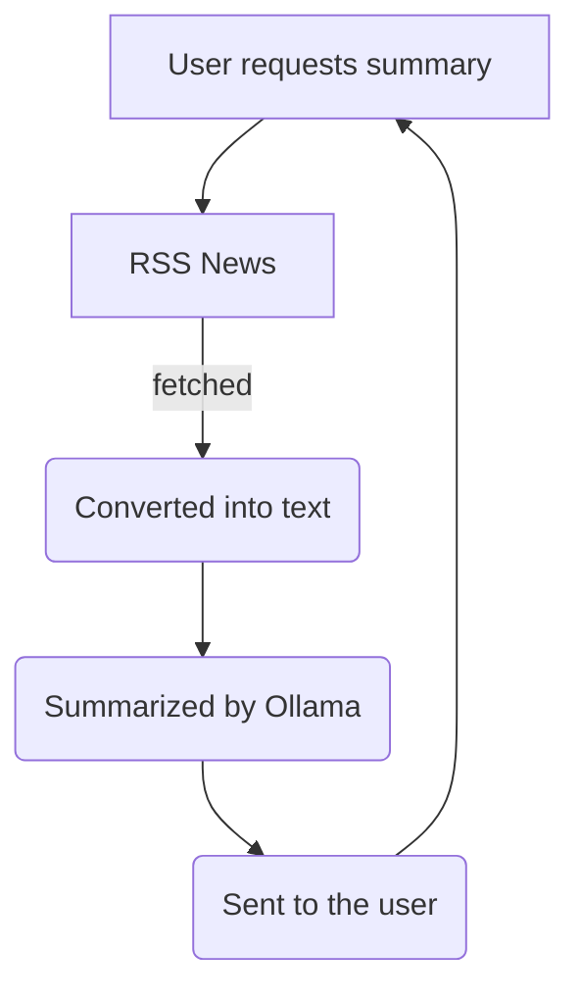

<div align="center">
  
  <h1>OllaNews</h1>
  <p><i>"News without the BS"</i></p>

  
  
  
</div>

---

## 🚀 Overview
OllaNews is a streamlined news aggregator that strips away the clutter. It fetches the latest updates, sanitizes the content into plain text, and uses a local **Ollama 3B** model to provide concise summaries.

### 🛠️ How it Works


---

## 📦 Modules Split

### 🎨 HTML Frontend [Sadiyah]
* **Landing Page:** Minimalist search interface to input news topics.
* **News List Page:** Dynamic feed of top 10 articles. Includes a **"Summarize"** button that fetches and displays AI summaries via JSON.
* **News Read Page:** Clutter-free reading mode with an integrated summarization trigger.

### ⚙️ Python Backend [Pranav]
* **Data Engine:** Automated fetching and sanitization of RSS/Google News feeds.
* **AI Integration:** Local pipeline to send plain text data to **Ollama (3B model)**.
* **API:** Django-powered HTTP server to handle all frontend requests.

---

## 📅 Timeline

> [!IMPORTANT]
> **Hard Deadline:** 29th March 
> **Status:** Active Development (Started 25th March)

#### 25th & 26th
- [ ] Landing page
- [ ] Fetching module
- [ ] Sanitization module

#### 26th & 27th
- [ ] Ollama setup
- [ ] HTTP server with Django
- [ ] News list page
- [ ] News read page

#### 28th
- [ ] Polish / Buffer / Bug fixes
```
